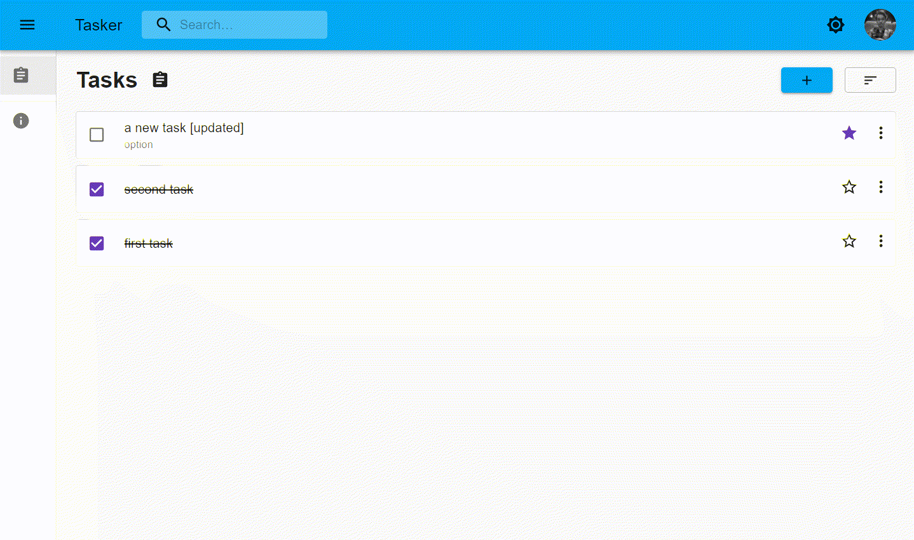

# Tasker

<h3 style="color:red">⚠️ Under construction ⚠️</h3>

A CRA to compete with any.do 💪.

| Branch   | CI builds                                                                                   |
| -------- | ------------------------------------------------------------------------------------------- |
| `master` |  |
| `dev`    |     |

## Contributing

Contributions are always welcome, no matter how large or small. Before contributing, please read the [code of conduct](CODE_OF_CONDUCT.md).

The `master` branch is restricted for `push` request. It can only update on `pull request` from `dev` branch.

## Setup your development server

`master` branch has `push` restrictions. Switch to `dev` branch for recent changes.

- Clone the `dev` branch.

```
git clone -b dev https://github.com/KaustubhPatange/To-do.git
```

- Install the dependencies.

```
npm install
```

- Save your firebase credential config in `src/utils/secrets.ts`.

- Start the server.

```
npm start
```

## First look

The current status of this branch looks like below, but it will likely change in future commits.



## License

- [The Apache License Version 2.0](https://www.apache.org/licenses/LICENSE-2.0.txt)

```
Copyright 2020 Kaustubh Patange

Licensed under the Apache License, Version 2.0 (the "License");
you may not use this file except in compliance with the License.
You may obtain a copy of the License at

   https://www.apache.org/licenses/LICENSE-2.0

Unless required by applicable law or agreed to in writing, software
distributed under the License is distributed on an "AS IS" BASIS,
WITHOUT WARRANTIES OR CONDITIONS OF ANY KIND, either express or implied.
See the License for the specific language governing permissions and
limitations under the License.
```
